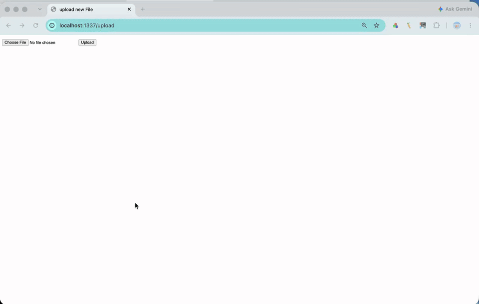

# Flask on Docker

[](https://github.com/LarryPi314/flask-on-docker/actions/workflows/ci.yml)

## Overview

This repository contains the source code that runs a Flask web app and a PostgreSQL database using Docker Compose. The production grade edition also runs Gunicorn as a WSGI server and Nginx as a reverse proxy. The app returns a JSON response, accepts image uploads, and serves uploaded files. The repository also includes a production setup with Gunicorn and Nginx.

## Demo



## Build Instructions

Install [Docker Desktop](https://www.docker.com/products/docker-desktop/) and make sure it is running. Then create a `.env.dev` file in the project root:

```env
FLASK_APP=project/__init__.py
FLASK_DEBUG=1
DATABASE_URL=postgresql+psycopg2://hello_flask:hello_flask@db:5432/hello_flask_dev
SQL_HOST=db
SQL_PORT=5432
DATABASE=postgres
APP_FOLDER=/usr/src/app
```

Build and start the services:

```sh
docker compose -f docker-compose.prod.yml up -d --build
docker compose exec web python manage.py create_db
```

Open these pages in a browser:

- App: <http://localhost:1148/>
- Upload form: <http://localhost:1148/upload>
- Uploaded image: `http://localhost:1148/media/<filename>`

To stop the services, run:

```sh
docker compose -f docker-compose.prod.yml down -v
```
